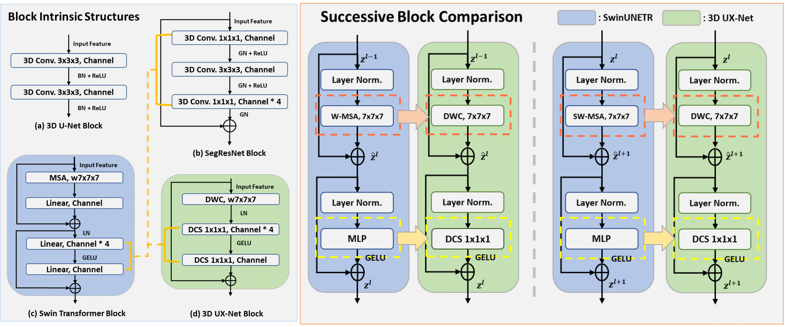
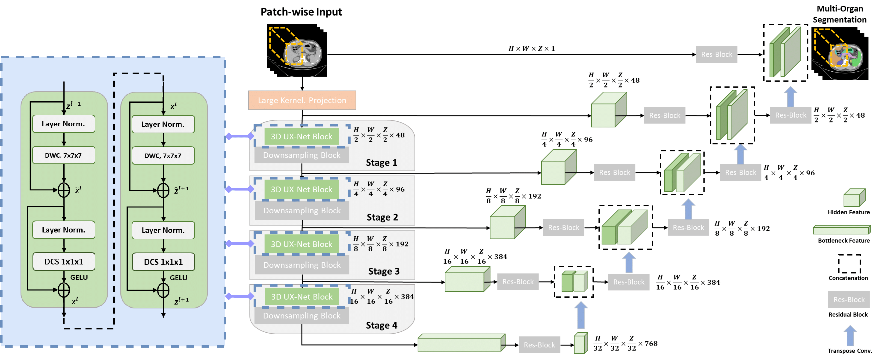

### [3D UX-Net: A Large Kernel Volumetric ConvNet Modernizing Hierarchical Transformer for Medical Image Segmentation](https://arxiv.org/abs/2209.15076)

Official Pytorch implementation of 3D UX-Net, from the following paper:

[3D UX-Net: A Large Kernel Volumetric ConvNet Modernizing Hierarchical Transformer for Medical Image Segmentation](https://arxiv.org/abs/2209.15076). ICLR 2023 (Accepted, Poster) \
Ho Hin Lee, Shunxing Bao, [Yuankai Huo](https://hrlblab.github.io/), [Bennet A. Landman](https://my.vanderbilt.edu/masi/people/bennett-landman-ph-d/) \
Vanderbilt University \
[[`arXiv`](https://arxiv.org/abs/2209.15076)]

---

<p align="center">

</p>

<p align="center">

</p>

We propose **3D UX-Net**, a pure volumetric convolutional network to adapt hierarchical transformers behaviour (e.g. Swin Transformer) for Medical Image Segmentation with less model parameters.

 ## Installation
 Please look into the [INSTALL.md](INSTALL.md) for creating conda environment and package installation procedures.

 ## Training Tutorial
 - [x] FeTA 2021, FLARE 2021 Training Code [TRAINING.md](TRAINING.md)
 - [x] AMOS 2022 Finetuning Code [TRAINING.md](TRAINING.md)
 
 (Feel free to post suggestions in issues of recommending latest proposed transformer network for comparison. Currently, the network folder is to put the current SOTA transformer. We can further add the recommended network in it for training.)
 
 <!-- ✅ ⬜️  -->
 
 ## Results 
 ### FeTA 2021 Trained Models (5-folds cross-validation)
 | Methods | resolution | #params | FLOPs | Mean Dice | Model
|:---:|:---:|:---:|:---:| :---:|:---:|
| TransBTS | 96x96x96 | 31.6M | 110.4G | 0.868 | |
| UNETR | 96x96x96 | 92.8M | 82.6G | 0.860 | |
| nnFormer | 96x96x96 | 149.3M | 240.2G | 0.863 | |
| SwinUNETR | 96x96x96 | 62.2M | 328.4G | 0.867 | |
| 3D UX-Net | 96x96x96 | 53.0M | 639.4G | 0.874 | [Weights](https://drive.google.com/file/d/1AqJMIM2w8OGGiN1FonmZqNoRHd2x5fTL/view?usp=share_link)

### FLARE 2021 Trained Models (5-folds cross-validation)
| Methods | resolution | #params | FLOPs | Mean Dice | Model 
|:---:|:---:|:---:|:---:| :---:|:---:|
| TransBTS | 96x96x96 | 31.6M | 110.4G | 0.902 | | 
| UNETR | 96x96x96 | 92.8M | 82.6G | 0.886 | |
| nnFormer | 96x96x96 | 149.3M | 240.2G | 0.906 | |
| SwinUNETR | 96x96x96 | 62.2M | 328.4G | 0.929 | |
| 3D UX-Net | 96x96x96 | 53.0M | 639.4G | 0.936 (latest)| [Weights](https://drive.google.com/file/d/1APxKmq3MuueY4KtuKAZG3vs3vPLetLaK/view?usp=share_link)


 ### AMOS 2022 Fine-tuned Models 
 | Methods | resolution | #params | FLOPs | Mean Dice (AMOS2022) | Model 
|:---:|:---:|:---:|:---:| :---:|:---:|
| TransBTS | 96x96x96 | 31.6M | 110.4G | 0.792 |
| UNETR | 96x96x96 | 92.8M | 82.6G | 0.762 | 
| nnFormer | 96x96x96 | 149.3M | 240.2G | 0.790 | 
| SwinUNETR | 96x96x96 | 62.2M | 328.4G | 0.880 | 
| 3D UX-Net | 96x96x96 | 53.0M | 639.4G | 0.900 (kernel=7) | [Weights](https://drive.google.com/file/d/1G8uhjKh8392UFtGsMeolO__Lmz3GLAiG/view?usp=share_link)

<!-- ✅ ⬜️  -->
## Training
Training and fine-tuning instructions are in [TRAINING.md](TRAINING.md). Pretrained model weights will be uploaded for public usage later on.

<!-- ✅ ⬜️  -->
## Evaluation
Efficient evaulation can be performed for the above three public datasets as follows:
```
python test_seg.py --root path_to_image_folder --output path_to_output \
--dataset flare --network 3DUXNET --trained_weights path_to_trained_weights \
--mode test --sw_batch_size 4 --overlap 0.7 --gpu 0 --cache_rate 0.2 \
```

## Acknowledgement
This repository is built using the [timm](https://github.com/rwightman/pytorch-image-models) library.

## License
This project is released under the MIT license. Please see the [LICENSE](LICENSE) file for more information.

## Citation
If you find this repository helpful, please consider citing:
```
@article{lee20223d,
  title={3D UX-Net: A Large Kernel Volumetric ConvNet Modernizing Hierarchical Transformer for Medical Image Segmentation},
  author={Lee, Ho Hin and Bao, Shunxing and Huo, Yuankai and Landman, Bennett A},
  journal={arXiv preprint arXiv:2209.15076},
  year={2022}
}
```

 
 


